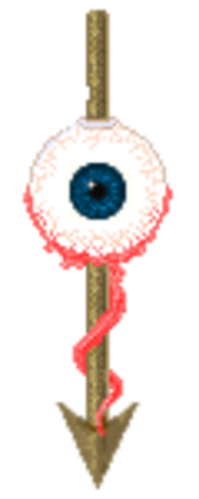
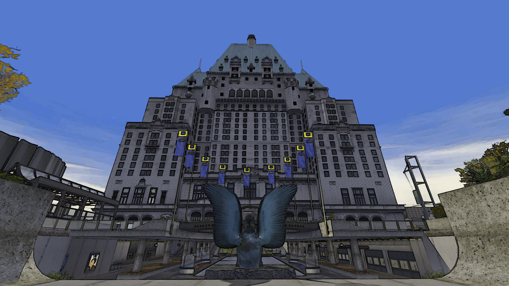
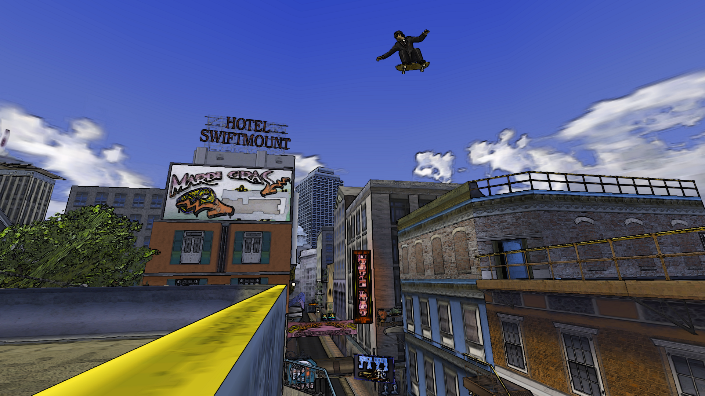
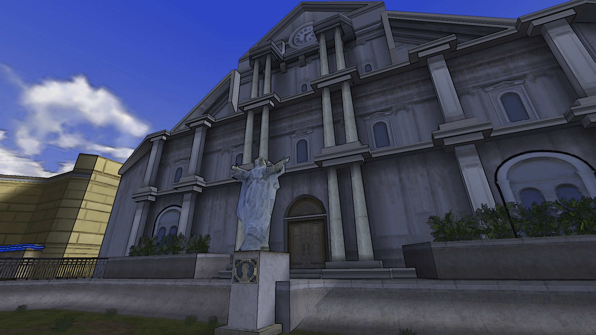

<div align="center">
  <a href="https://github.com/5ukui/THUGPRO-Comic-Outline-Reshade-Preset">
    
  </a>
</div>

## Installation
1. Download the latest release [here](https://github.com/5ukui/THUGPRO-Comic-Outline-Reshade-Preset/releases/download/v1.0.0/Reshade.zip).
2. Extract the files from the archive into THUGPRO's installation directory ("C:\Users\USERNAME\AppData\Local\THUG Pro" by default).
3. Launch the game and press the "Home" button on your keyboard. This should open up Reshade's panel.
4. Go to settings and make sure that the:

> • Presets Search Paths is set to:
```
C:\Users\USERNAME\AppData\Local\THUG Pro\reshade-shaders\Presets
```

> • Effect Search Paths is set to:
```
C:\Users\USERNAME\AppData\Local\THUG Pro\reshade-shaders\Shaders
```

> • Texture Search Paths is set to:
```
C:\Users\USERNAME\AppData\Local\THUG Pro\reshade-shaders\Shaders
```
5. Go back to the main tab, click the "Reload" button at the buttom then the "+" button at the far top right side of the panel and type in "ComicBook" and press enter.

## Screenshots
<div align="center">
  
  
  
  
  
  
  
  
  
</div>
